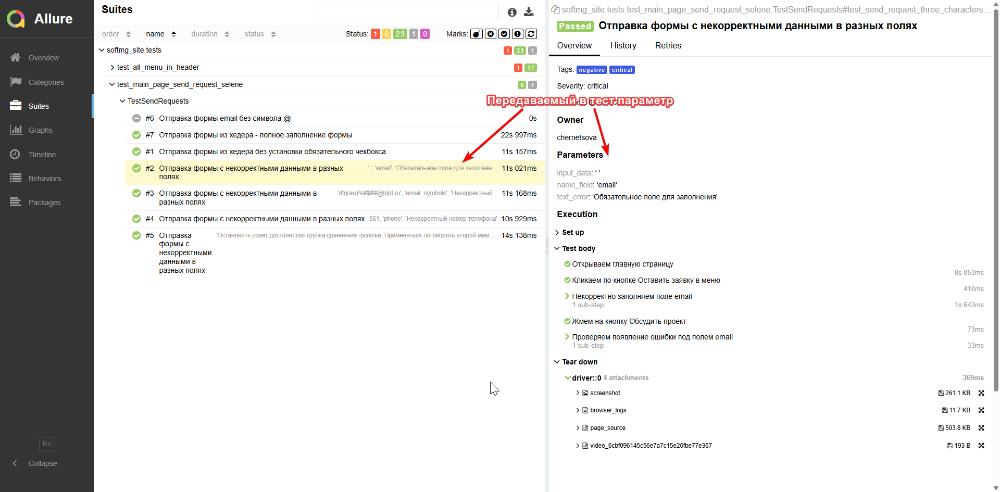
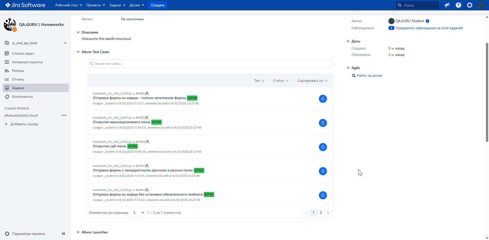
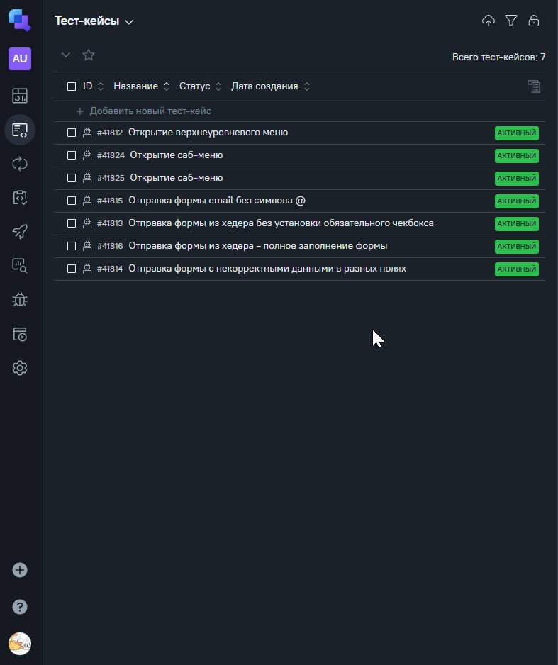
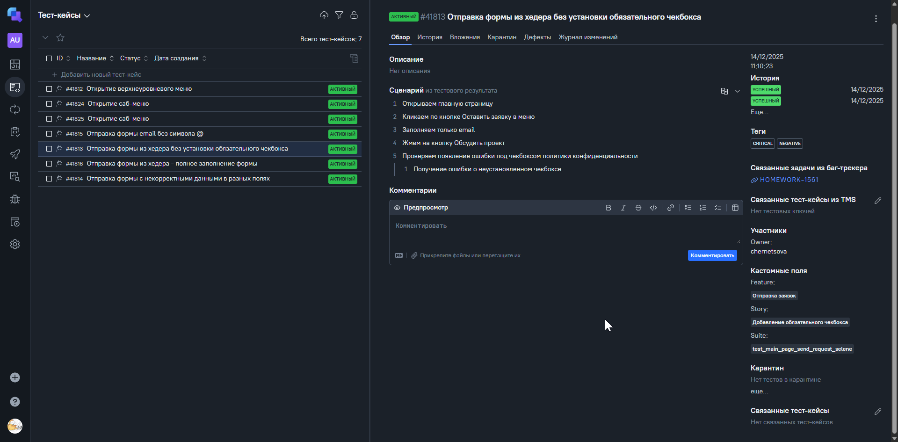
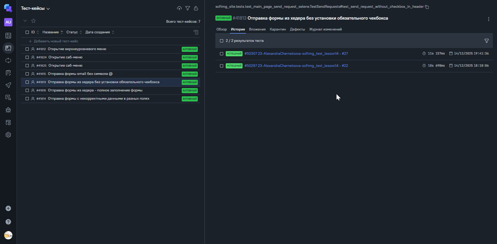
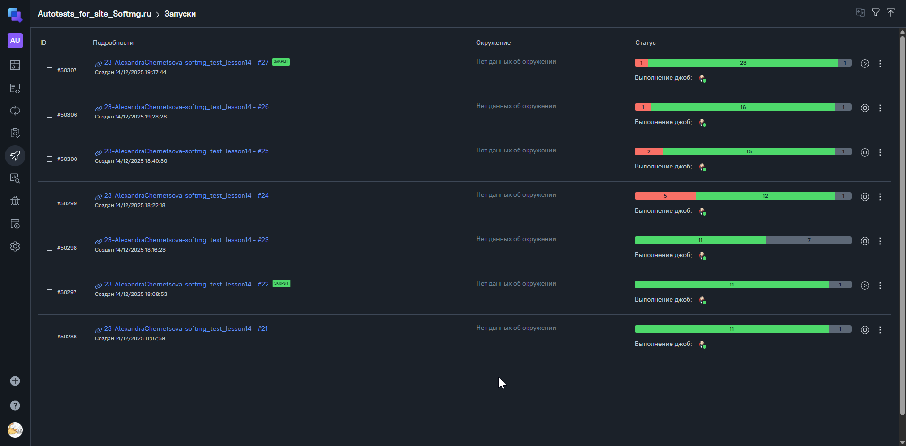

# Фреймворк для автоматизации тестирования сайта "Softmg.ru"

  <a target="_blank" href="https://Softmg.ru/">
    
  </a>

----

### Оглавление 🤸

- [В проекте реализовано ](#in_project)

- [Список проверок](#list_test)

- [Используемый стэк](#stack)

- [Локальный запуск автотестов 🧙‍♂️](#local_start_project)
    - [Запуск 🦧](#start_test)
    - [Получение отчёта 🧑‍💻](#allure_serve)

- [Отчет в Jenkins 🪄](#project_in_jenkins)
    - [Параметры сборки 🦧](#param_in_jenk)
    - [Запуск 🧑‍💻](#start_test_jenk)

- [Allure отчет 🪄](#allure_report)

- [Интеграция с Jira 🪄](#jira_integration)

- [Интеграция с AllureTestOps 🪄](#allure_testOps_integration)

- [Оповещения 🪄](#notification_tg)

- [Видео 🪄](#video)

----

 

----

### <a name="in_project">В проекте реализовано:</a>

* Оповещения о тестовых прогонах в Telegram
* Отчеты с видео, скриншотом, логами, исходной моделью разметки страницы
* Сборка проекта в Jenkins
* Отчеты Allure Report
* Запуск web/UI автотестов в Selenoid
* Запуск тестов на dev и prod контурах

### <a name="list_test">Список проверок, реализованных в UI автотестах</a>

- [x] Проверка успешной отправки заявки
- [x] Проверка негативных кейсов отправки заявок
- [x] Проверка работоспособности меню (включая вложенность)
- [x] Запуск тестов на разных окружениях

----

### <a name="list_test">Список проверок, реализованных в API автотестах</a>

- [x] Проверки линков на главной странице и странице услуг
- [x] Проверка успешной отправки заявок со всех форм
- [x] Проверка негативных кейсов отправки заявок со всех форм
- [x] Проверка отдачи количества кейсов на главной странице кейсов
- [x] Запуск тестов на разных окружениях
- [x] Проверка результатов поиска
- [x] Проверка результата запроса кейсов по тегу

## Особенности API
- [x] Реализованы проверки только статус-кода при отправке заявок, т.к. при успешной отправке заявок тело ответа пустое. 


----

### <a name="stack">Используемый стэк</a>

           

- **Python** — язык программирования, на котором написаны UI-автотесты
- **Pytest** — фреймворк для организации и запуска тестовых сценариев
- **Selene** — фреймворк для UI-автотестирования на базе Selenium WebDriver
- **Selenoid** — инструмент для удалённого запуска браузеров в контейнерах
- **Jenkins** — CI-система для параметризованного запуска автотестов
- **Allure Report** — система формирования подробных отчётов о результатах тестирования
- **Allure TestOps** — платформа для управления тест-кейсами и аналитики прогонов
- **PyCharm** — среда разработки для написания и отладки автотестов
- **Jira** — система управления задачами и дефектами
- **Telegram** — канал для уведомлений о результатах выполнения тестов

----

### <a name="local_start_project">Локальный запуск автотестов</a>

#### <a name="start_test">Запуск тестов:</a>

Для запуска web/UI автотестов выполнить в cli:

```bash
python -m venv .venv
source .venv/bin/activate
pip install -r requirements.txt
pytest --alluredir=allure-results

```

Для получения отчета выполнить в cli:

#### <a name="allure_serve">Получение отчёта:</a>

```bash
allure serve allure-results
```

----

### <a name="project_in_jenkins">Проект в Jenkins</a>

> <a target="_blank" href="https://jenkins.autotests.cloud/job/23-AlexandraChernetsova-softmg_test_lesson14/">Ссылка</a>

#### <a name="param_in_jenk">Параметры сборки</a>

```python
ENVIRONMENT = ['development', 'PROD_PAGE'] # Окружение
BROWSER_VERSION = '127.0' # Версия браузера хром. Можно запускать на 128.0
```

#### <a name="start_test_jenk">Запуск автотестов в Jenkins</a>

1. Открыть <a target="_blank" href="https://jenkins.autotests.cloud/job/23-AlexandraChernetsova-softmg_test_lesson14/">
   проект</a>


1. Нажать "Build with Parameters"
2. Из списка "ENVIRONMENT" выбрать окружение
3. Необходимо выбрать TAGS в зависимости от контура


4. В поле "BROWSER_VERSION" ввести версию браузера (запуск возможен в 128.0 и 127.0 версиях)
5. Нажать "Build"


   > Если выбран контур development - необходимо выбрать TAGS. 
   > Если необходимо запустить все тесты - нужно выбрать тэг all.
   > Если выбран контур PROD_PAGE - можно выбрать теги regression и prod.
   > Т.к. на проде запускаются не все тесты, которые могут быть запущены на проде.


----

### <a name="allure_report">Allure отчет</a>

#### <a target="_blank" href="https://jenkins.autotests.cloud/job/23-AlexandraChernetsova-softmg_test_lesson14/">Открытие отчета после сборки</a>


#### <a target="_blank" href="https://jenkins.autotests.cloud/job/23-AlexandraChernetsova-softmg_test_lesson14/27/allure/#">Общие результаты</a>


#### <a target="_blank" href="https://jenkins.autotests.cloud/job/23-AlexandraChernetsova-softmg_test_lesson14/27/allure/#suites">Результаты прохождения теста</a>


#### <a target="_blank" href="https://jenkins.autotests.cloud/job/23-AlexandraChernetsova-softmg_test_lesson14/27/allure/#suites">Результаты прохождения теста с параметрами</a>




----

### <a name="jira_integration">Интеграция с Jira</a>

#### <a target="_blank" href="https://jira.autotests.cloud/browse/HOMEWORK-1561">Задача в Jira</a>



---

### <a name="allure_testOps_integration">Интеграция с AllureTestOps</a>

### [AllureTestOps_dashboard](https://allure.autotests.cloud/project/5048/dashboards)

Дашборд с результатами о прохождении тестов.


#### Общий список всех кейсов, имеющихся в системе



#### Пример отчёта выполнения одного из автотестов



#### История запуска одного теста



#### История запуска тестовых наборов



---

### <a name="notification_tg">Оповещения в Telegram</a>


----

### <a name="video">Видео прохождения web/UI автотеста</a>


